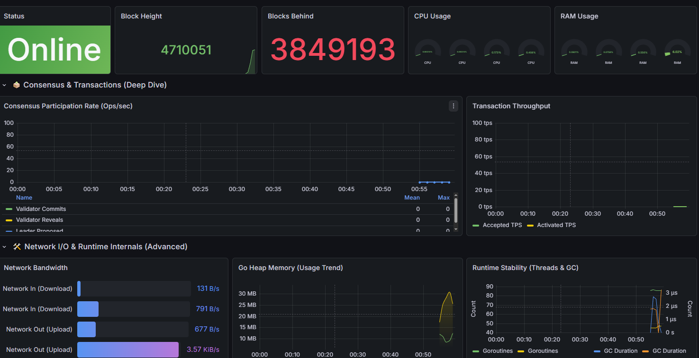

# GenLayer Node Dashboard

This Grafana dashboard provides deep insights into your node's consensus participation, transaction throughput (TPS), synchronization status, and system resource usage (Go runtime, CPU, RAM). It is designed to help node operators maintain high uptime and troubleshoot issues quickly.



## ✨ Features

* **Real-time Health Check**: Instant visual feedback on Validator status (Active/Banned/Down).
* **Consensus Deep Dive**: Track `Commit` and `Reveal` rates to ensure you are voting correctly in the consensus rounds.
* **Transaction Metrics**: Granular TPS breakdown (Accepted into Mempool vs. Activated/Processed).
* **Network I/O**: Visual bar gauges for real-time Upload/Download bandwidth usage.
* **Runtime Internals**: Advanced monitoring of Go Goroutines, Heap Memory, and Garbage Collection (GC) latency to detect performance bottlenecks.

---

## 🛠️ Requirements

Before importing this dashboard, ensure you have the following components running:

1. **GenLayer Node**: A running validator node exposing metrics on port `9153` (default).
2. **Prometheus**: Configured to scrape the GenLayer node.
3. **Grafana**: v10.0 or higher is recommended for the best visualization experience.

### Datasources

* **Prometheus** (Required): The primary source for all metrics (`up`, `genlayer_*`, `go_*`, `process_*`).

---

## ⚙️ Installation & Setup

### 1. Configure Prometheus

To ensure the dashboard displays data correctly, your `prometheus.yml` **MUST** use the exact job name: `genlayer-validator`.

Add the following snippet to your `scrape_configs` in `prometheus.yml`:

```yaml
scrape_configs:
  - job_name: 'genlayer-validator'
    static_configs:
      - targets: ['TODO:IPPort:9153'] # Use your node's actual IP:Port
        labels:
          instance: 'My-Validator'
    scrape_interval: 5s # Recommended for real-time updates
```

> **Note:** If you are running Prometheus inside Docker on Windows/Mac, use `host.docker.internal:9153`. On Linux, use the host IP (e.g., `172.17.0.1:9153`).

### 2\. Import Dashboard to Grafana

1. Open Grafana and navigate to **Dashboards** -\> **New** -\> **Import**.
2. Upload the `dashboard.json` file (or paste the JSON content).
3. Select your **Prometheus** datasource from the dropdown menu.
4. Click **Import**.

-----

## 📊 Panels Explained

Here is a detailed breakdown of the metrics displayed:

### 🟢 Node Overview & Health

* **Validator Status**:
  * \<span style="color:green"\>**GREEN**\</span\>: Node is UP and reachable.
  * \<span style="color:red"\>**RED**\</span\>: Node is DOWN or unreachable.
* **Block Height**: The current block number the node has processed.
* **Sync Lag**: Shows how many blocks behind the network head your node is. (Should be 0 or close to 0).
* **CPU/RAM Gauge**: Real-time resource usage with color-coded thresholds (Green -\> Orange -\> Red).

### 🗳️ Consensus & Transactions

* **Consensus Participation**: Tracks the rate of `Validator Commits` and `Validator Reveals`. A drop in these lines indicates missed voting rounds.
* **Transaction Throughput**:
  * **Accepted**: Transactions entering the mempool.
  * **Activated**: Transactions successfully moved to execution.

### 🛠️ Network & Runtime

* **Network Bandwidth**: Horizontal bars showing Inbound (Download) and Outbound (Upload) traffic.
* **Go Heap Memory**: Visualizes memory allocation trends. Constant growth without drops may indicate a memory leak.
* **Runtime Stability**:
  * **Goroutines**: Number of active lightweight threads.
  * **GC Duration**: Time spent on Garbage Collection. High spikes (\>1s) can cause the node to miss blocks.

<!-- end list -->


